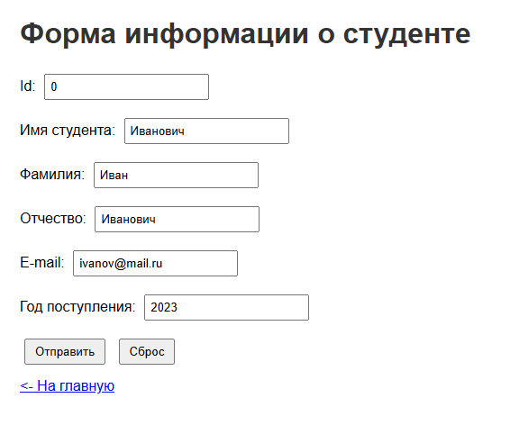
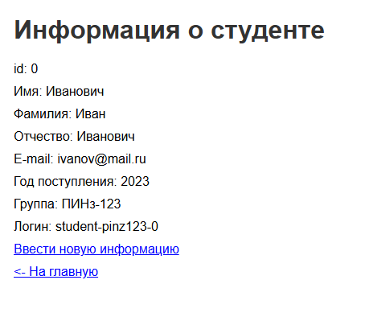

# Лабораторная работа №1. Введение в Spring Boot

## Цель работы
Изучить работу Spring Boot на примере обработки данных с формы.

## Архитектура проекта
- **Стек:** Spring Boot 4.1.1, Maven, Thymeleaf, Java 17
- **Основные слои:**
    - **Controller** - обработка HTTP-запросов (`MainController`).
    - **Model** - POJO-класс `Student` для хранения данных формы.
    - **View** - HTML-шаблоны Thymeleaf (`main.html`, `about.html`, `main-form.html`, `result.html`).
    - **Static** - ресурсы (CSS-стили, изображения).
- **Ключевые аннотации:**
    - `@Controller` — определяет класс как контроллер.
    - `@GetMapping` — обработка GET-запросов.
    - `@PostMapping` — обработка POST-запросов (отправка формы).
    - `@RequestParam` — извлечение параметров из строки запроса.
    - `@ModelAttribute` — связывание данных формы с объектом модели.

## Алгоритм работы
1.  **Главная страница (`/`)** - GET-запрос возвращает шаблон `main` с приветственными данными.
2.  **Страница автора (`/about`)** - GET-запрос с необязательным параметром `name` (по умолчанию «Имя автора»).
3.  **Форма ввода (`/form`)** - GET-запрос отображает форму для ввода данных студента.
4.  **Обработка формы (`POST /form`):**
    - Принимаются данные студента (ID, ФИО, email, год поступления).
    - Из года поступления извлекаются последние две цифры.
    - Формируется группа: `ПИНз-1` + последние две цифры года (например, `ПИНз-120`).
    - Формируется логин: `student-` + группа + `-` + `id` (например, `student-pinz120-12`).
    - Результат передаётся в шаблон `result` для отображения.

## Скриншот работы приложения

### Форма ввода информации о студенте
  

### Результат обработки
  
